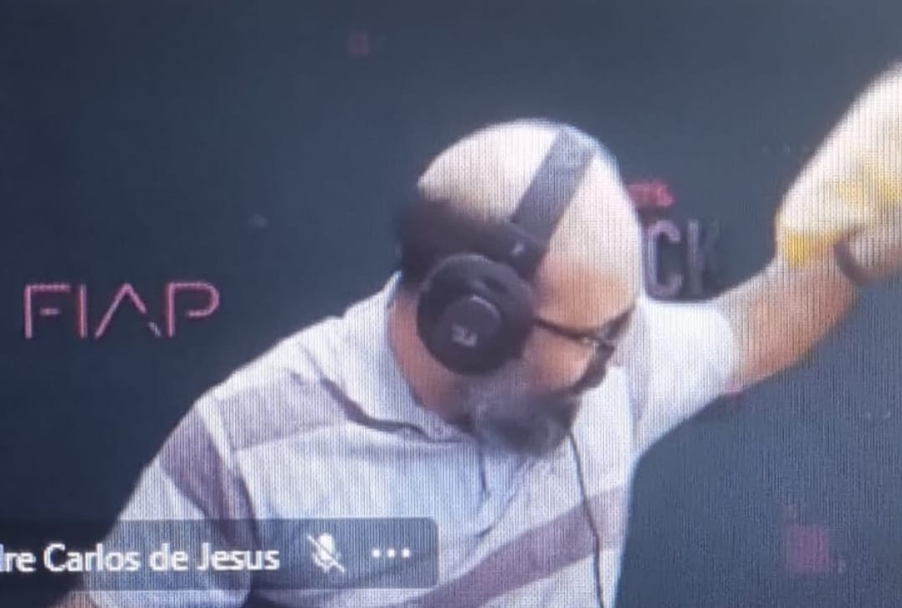

  
# Entregas de Front End

 

---

Neste repositório está presente o desenvolvimento da entrega do challenge de 2024 da matéria **Front-End Design Engineering** da faculdade FIAP.

### Membros do grupo:
- Erick Alves - <a href="https://github.com/Erick0105">Erick0105</a> - Rm 5568682
- Vicenzo Oliveira - <a href="https://github.com/fFukurou">fFukurou</a> - Rm 554833
- Luiz Henrique - <a href="https://github.com/LuizHNR">LuizHNR</a> - Rm 556864

---

Dentro destes repósitorio estão presentes os seguintes arquivos:
- Um arquivo base que é o da página principal, "index.html";
- Uma pasta html com os arquivos base das outras páginas html;
- Uma pasta js com os arquivos arquivos JavaScript utilizados;
- Uma pasta css com arquivos de estilos das nossas páginas web;
- Uma pasta de imagens com todas as imagens dos projetos;

### Nosso Professor:

###### Marcel Thomé Filho

